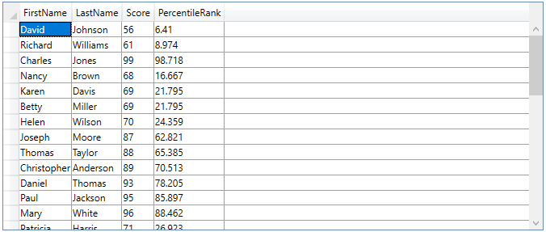
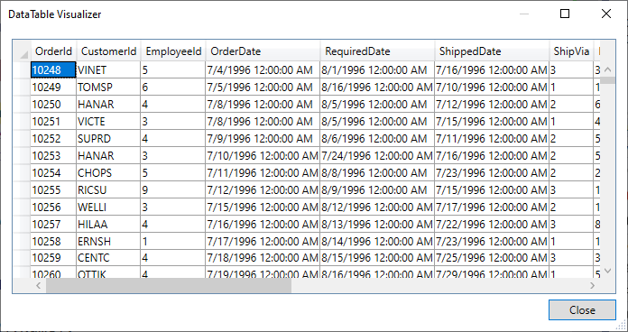
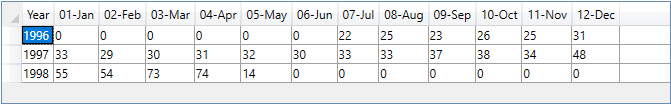

# DataMatrix
Data container used to transform, analyze and summarize data.

## Installation

using dotnet cli
```sh
$ dotnet add package DataMatrix
```

using Nuget Package Manager
```sh
PM> Install-Package DataMatrix
```

## Quick Examples

### Add Calculated Columns

Consider the dataset of student scores below


You can add each students percentile rank using a DataMatrix as follows

```javascript
var dm = DataMatrixFactory.Create(table, "FirstName,LastName,Score", new DataMatrixColumn
{
    Name = "PercentileRank",
    DependsOn = new[] {"Score"},
    Initialize = PercentileRank.Initialize,
    Compute = PercentileRank.Compute
});

var dt = dm.ToDataTable();
```


> Note that **PercentileRank** is a built in function. You can also use simple functions like below.

> Other functions included are **Outlier** and **Standard Deviation** (from mean). Others will be added as needed.

```javascript
var dm = DataMatrixFactory.Create(table, "Score", new DataMatrixColumn
{
    Name = "Name",
    DependsOn = new[] {"FirstName", "LastName"},
    Compute = (values, args) => values[0] + " " + values[1]
});
```

### Create a Cross Tabulation

You can also create cross tabulations using the Pivot function as shown below.

Consider the dataset of Northwind Orders below



```javascript
var builder = DataMatrixBuilder.Create(list, "OrderDate");
builder.AddColumn("Year", "OrderDate", (values, args) => $"{values[0]:yyyy}");
builder.AddColumn("Month", "OrderDate", (values, args) => $"{values[0]:MM-MMM}");

var dm = builder.Build();
dm = dm.Pivot("Year", "OrderDate", AggregateFunction.Count, "Month");
```

